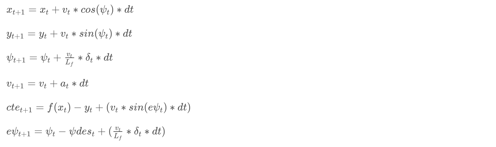

# CarND-Controls-MPC
Self-Driving Car Engineer Nanodegree Program

---

## Reflection

### The Model
I have used kinematic bicycle model in this project. It ignores effects of tire forces, gravity, torque etc. Implementation for the model can be found in `FG_eval` class of `MPC.cpp`. The model implements following equations in lines 105 through 110.

Here *x*, *y* are vehicle position, *ψ* is heading angle, *v* is velocity, *Lf* measures the distance between the front of the vehicle and its center of gravity. The model uses steering wheel *δ* and throttle *a* as actuator controls.

### Timestep Length and Elapsed Duration (N & dt)
I chose `N = 10` and `dt = 0.05` so as to get time horizon of 0.5 seconds and it allowed the car to be driven at more than 50 mph with smooth controls. Increasing `N` to 20 resulted in higher speed but car going out from the road surface around corners. Setting `N` equal to 5 reduced the time horizon to just 0.25 seconds and since not enough data is captured, the car goes out of track immediately.

### Polynomial Fitting and MPC Preprocessing
Preprocessing involves transforming given waypoints to vehicle coordinate system, code for this can be found in lines 103 through 115 of `main.cpp`. A third order polynomial fit is then performed on these waypoints to get coefficients for MPC.

### Model Predictive Control with Latency
In order to account for latency of actuation command propogation, a 100 ms delay is introduced before sending out each actuation command, code for this can be found on line 178 of `main.cpp`. Next actuation commands were also shifted by `100 ms / dt = 2` time steps (line 12 of `MPC.cpp`) and sent to the simulator (line 125, 126 of `main.cpp`).

### Simulation
Here's a video which shows the car driving around for two laps with above configuration.

